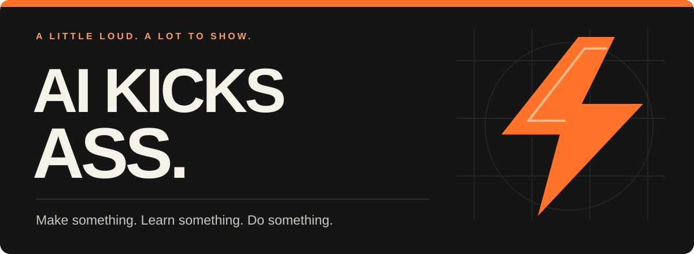

# AI Kicks Ass ⚡

[అన్ని భాషలు](../../LANGUAGES.md) · [English](../../README.md)

**AI మీకు ఏదైనా సృష్టించడానికి, నేర్చుకోవడానికి లేదా ఇంతకు ముందు చేయలేని పని చేయడానికి సహాయపడితే ఈ రిపోజిటరీకి స్టార్ ఇవ్వండి.**

AIలో లోపాలు ఉన్నాయి. అద్భుతమైన పనులు కూడా చేస్తుంది.

## ఉదాహరణలు

### మెదడు సంకేతాల నుంచి స్వరం · 2025

పరిశోధకులు మెదడులో అమర్చిన పరికరాన్ని AIతో కలిపి తీవ్రమైన పక్షవాతం ఉన్న పాల్గొనేవారి కోసం నిరంతర కృత్రిమ మాటను రూపొందించారు. గాయానికి ముందు రికార్డులతో స్వరాన్ని వ్యక్తిగతీకరించారు. AI మాటకు సంబంధించిన సంకేతాలను విశ్లేషించింది; పాల్గొనేవారు శిక్షణ ప్రయత్నాలు ఇచ్చారు, బృందం వ్యవస్థను అభివృద్ధి చేసి అంచనా వేసింది. ఇది అమర్చిన పరికరం, వ్యక్తిగత శిక్షణ అవసరమైన క్లినికల్ పరిశోధన; శరీరపు సహజ స్వర సామర్థ్యం తిరిగివచ్చిందని కాదు.

[మూలం](https://www.universityofcalifornia.edu/news/brain-voice-neuroprosthesis-restores-naturalistic-speech)

### కాలిపోయిన చుట్టలోని అక్షరాలు · 2024

Vesuvius Challenge బృందం ఇంకా చుట్టి ఉన్న హెర్క్యులేనియం చుట్టలో 15 పాక్షిక వచన నిలువు వరుసలను బయటపెట్టింది. AI స్కాన్ చేసి వర్చువల్‌గా విప్పిన ఉపరితలాలపై సిరాను గుర్తించింది. మనుషులు చిత్రీకరణ, ఉపరితల సిద్ధీకరణ, మోడల్ అభివృద్ధి, వచన అర్థీకరణ చేశారు. ఇది నిర్వాహకులు నివేదించి సమీక్షించిన పాక్షిక పునరుద్ధరణ; మొత్తం గ్రంథాలయాన్ని చదవడం కాదు.

[మూలం](https://scrollprize.org/grandprize)

### 20 కోట్లకు పైగా ప్రోటీన్ నిర్మాణ అంచనాలు · 2022

AlphaFold, EMBL-EBI 20 కోట్లకు పైగా ప్రోటీన్ నిర్మాణ అంచనాలను బహిరంగం చేశాయి. AI నిర్మాణాలను అంచనా వేసింది; పరిశోధకులు మోడల్‌ను అభివృద్ధి చేసి పరీక్షించారు, బృందాలు డేటాబేస్‌ను విడుదల చేశాయి, శాస్త్రవేత్తలు ఉపయోగాన్ని అంచనా వేస్తారు. విశ్వసనీయత మారుతుంది. ఇవి ప్రతి నిర్మాణానికి ప్రయోగాత్మక నిర్ధారణలు లేదా అంతే సంఖ్యలో చికిత్సల ఆవిష్కరణలు కావు.

[మూలం](https://deepmind.google/science/alphafold/)

## పాల్గొనండి

చిన్న విజయాలు కూడా ముఖ్యమే. మీ భాషలో సమాధానం ఇవ్వండి. వ్యక్తిగత అనుభవాలను స్పష్టంగా అలా పేర్కొని, పరిశీలించగల ఫలితం ఉందో లేదో తెలియజేయండి. చేర్చే ముందు ప్రతిపాదనలు సమీక్షిస్తారు.

- ఏం జరిగింది, ఎప్పుడు?
- AI సాధనం లేదా మోడల్ ఏం చేసింది?
- మీరు మరియు ఇతరులు ఏం చేశారు?
- ఏ బహిరంగ ఆధారాలను పరిశీలించవచ్చు?
- ఏ పరిమితులు లేదా ధృవీకరించని అంశాలు ఉన్నాయి?

[ఫలితాన్ని పంపండి](https://github.com/kaluli123123/ai-kicks-ass/issues/new?title=%5BWin%5D%20&body=%23%23%23%20%E0%B0%8F%E0%B0%82%20%E0%B0%9C%E0%B0%B0%E0%B0%BF%E0%B0%97%E0%B0%BF%E0%B0%82%E0%B0%A6%E0%B0%BF%2C%20%E0%B0%8E%E0%B0%AA%E0%B1%8D%E0%B0%AA%E0%B1%81%E0%B0%A1%E0%B1%81%3F%0A%0A%0A%23%23%23%20AI%20%E0%B0%B8%E0%B0%BE%E0%B0%A7%E0%B0%A8%E0%B0%82%20%E0%B0%B2%E0%B1%87%E0%B0%A6%E0%B0%BE%20%E0%B0%AE%E0%B1%8B%E0%B0%A1%E0%B0%B2%E0%B1%8D%20%E0%B0%8F%E0%B0%82%20%E0%B0%9A%E0%B1%87%E0%B0%B8%E0%B0%BF%E0%B0%82%E0%B0%A6%E0%B0%BF%3F%0A%0A%0A%23%23%23%20%E0%B0%AE%E0%B1%80%E0%B0%B0%E0%B1%81%20%E0%B0%AE%E0%B0%B0%E0%B0%BF%E0%B0%AF%E0%B1%81%20%E0%B0%87%E0%B0%A4%E0%B0%B0%E0%B1%81%E0%B0%B2%E0%B1%81%20%E0%B0%8F%E0%B0%82%20%E0%B0%9A%E0%B1%87%E0%B0%B6%E0%B0%BE%E0%B0%B0%E0%B1%81%3F%0A%0A%0A%23%23%23%20%E0%B0%8F%20%E0%B0%AC%E0%B0%B9%E0%B0%BF%E0%B0%B0%E0%B0%82%E0%B0%97%20%E0%B0%86%E0%B0%A7%E0%B0%BE%E0%B0%B0%E0%B0%BE%E0%B0%B2%E0%B0%A8%E0%B1%81%20%E0%B0%AA%E0%B0%B0%E0%B0%BF%E0%B0%B6%E0%B1%80%E0%B0%B2%E0%B0%BF%E0%B0%82%E0%B0%9A%E0%B0%B5%E0%B0%9A%E0%B1%8D%E0%B0%9A%E0%B1%81%3F%0A%0A%0A%23%23%23%20%E0%B0%8F%20%E0%B0%AA%E0%B0%B0%E0%B0%BF%E0%B0%AE%E0%B0%BF%E0%B0%A4%E0%B1%81%E0%B0%B2%E0%B1%81%20%E0%B0%B2%E0%B1%87%E0%B0%A6%E0%B0%BE%20%E0%B0%A7%E0%B1%83%E0%B0%B5%E0%B1%80%E0%B0%95%E0%B0%B0%E0%B0%BF%E0%B0%82%E0%B0%9A%E0%B0%A8%E0%B0%BF%20%E0%B0%85%E0%B0%82%E0%B0%B6%E0%B0%BE%E0%B0%B2%E0%B1%81%20%E0%B0%89%E0%B0%A8%E0%B1%8D%E0%B0%A8%E0%B0%BE%E0%B0%AF%E0%B0%BF%3F%0A%0A) · [సవరణ సూచించండి](https://github.com/kaluli123123/ai-kicks-ass/issues/new?title=%5BCorrection%5D%20&body=%E0%B0%8F%20%E0%B0%AC%E0%B0%B9%E0%B0%BF%E0%B0%B0%E0%B0%82%E0%B0%97%20%E0%B0%86%E0%B0%A7%E0%B0%BE%E0%B0%B0%E0%B0%BE%E0%B0%B2%E0%B0%A8%E0%B1%81%20%E0%B0%AA%E0%B0%B0%E0%B0%BF%E0%B0%B6%E0%B1%80%E0%B0%B2%E0%B0%BF%E0%B0%82%E0%B0%9A%E0%B0%B5%E0%B0%9A%E0%B1%8D%E0%B0%9A%E0%B1%81%3F%0A%0A)

---

[AI Did That](https://github.com/kaluli123123/ai-did-that)

ఇది AI సహాయంతో చేసిన అనువాదం; స్వతంత్ర మాతృభాషా సమీక్ష జరగలేదు. బయటి మూలాలు, పూర్తి వివరాలు ఆంగ్లంలో ఉండవచ్చు. అనువాద సవరణలకు స్వాగతం.

మూల రచనలు, చిత్రాలు MIT లైసెన్స్ కింద ఉన్నాయి. బయటి సామగ్రి హక్కులు వాటికే చెందుతాయి. [MIT](../../LICENSE)
